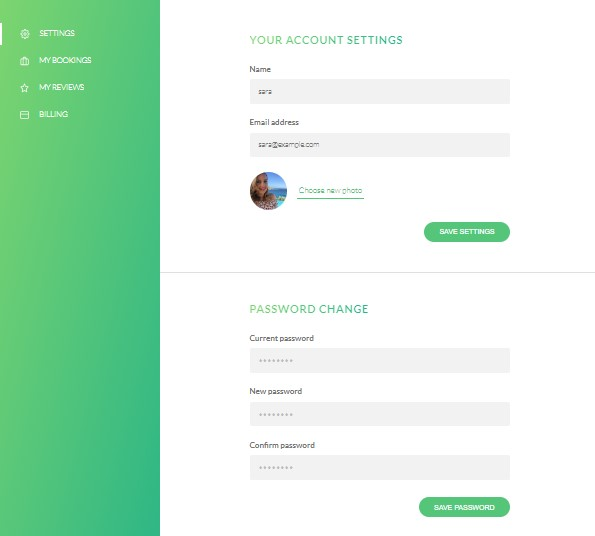

# Natours

Server Side rendered node app.

## Description

Tools used build the project are listed here.

- NodeJS - JS runtime environment
- Express - The web framework used
- Mongoose - Object Data Modelling (ODM) library
- MongoDB Atlas - Cloud database service
- Pug - High performance template engine
- JSON Web Token - Security token
- ParcelJS - Blazing fast, zero configuration web application bundler
- Stripe - Online payment API
- Postman - API testing
- Mailtrap & Sendgrid - Email delivery platform

## Overview

Tour detail page.

Map for showing tour path.

User account details.

### Authentication

JWT authentication is used and the JWT-Token is saved in the HTTP-Only cookie. Users can now be logged in automatically when next time accessing the protected routes.

## License

This project is licensed under the [GNU] License - see the LICENSE.md file for details
